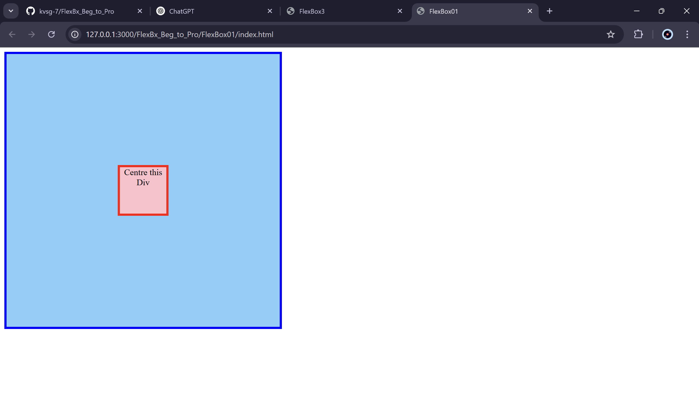
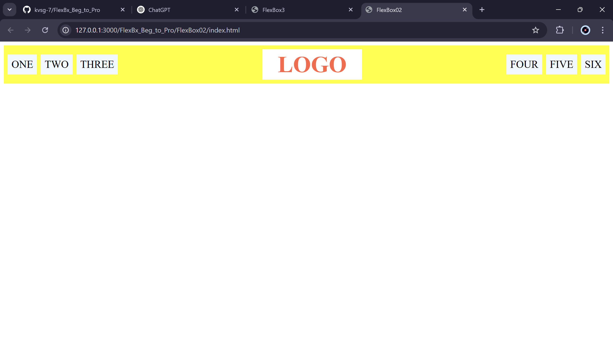
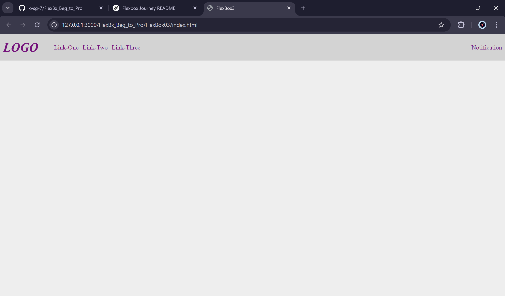
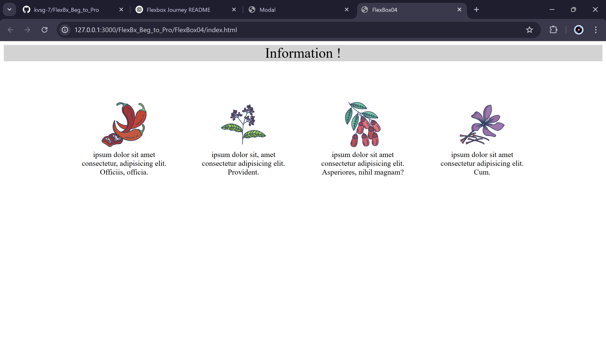
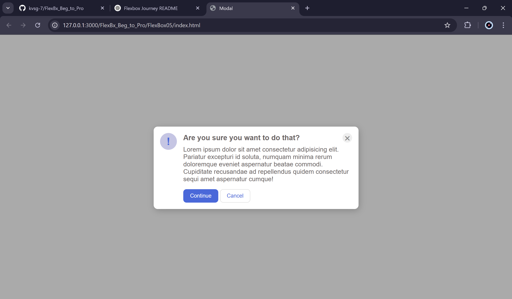
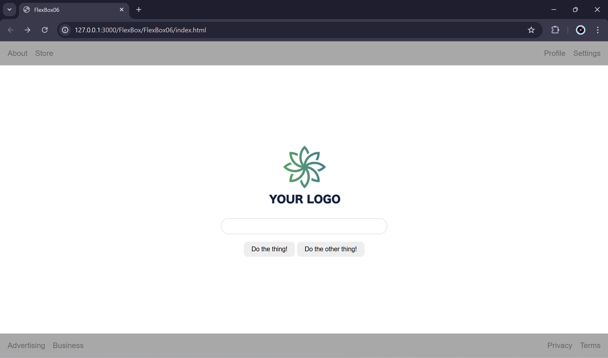

# FlexBx_Beg_to_Pro
# 🚀 Mastering Flexbox: My Journey from Beginner to Pro

Welcome to **Flexbox Mastery**, a repository documenting my journey from learning the fundamentals of CSS Flexbox to building a full-fledged website using it! This series consists of **six progressive projects (Flexbox01 to Flexbox06)**, each focusing on different aspects of Flexbox, culminating in a final project that showcases everything learned.

This journey is inspired by **The Odin Project (TOP)**, a comprehensive web development curriculum that helped me build a strong foundation in modern frontend techniques.

## 📌 What You'll Find Here
Each folder in this repository contains a structured project that covers key Flexbox concepts, making it a great reference for anyone looking to learn or reinforce their knowledge.

### 🔥 Project Breakdown

1. **Flexbox01 - Basics & Fundamentals**  
   - Understanding `display: flex` and `flex-direction`
   - Introduction to `justify-content` and `align-items`
   

2. **Flexbox02 - Spacing & Layout Adjustments**  
   - Working with `padding`, `margin`, and `gap`
   - Exploring `justify-content` and `align-items` for layout positioning
   

3. **Flexbox03 - Nested Flexbox Layouts**  
   - Building complex layouts with multiple flex containers
   - Understanding `flex-basis`, `flex-grow`, and `flex-shrink`
   

4. **Flexbox04 - Informative Site Replica**  
   - Creating a structured informative website layout
   - Inserting images with proper alignment and wrapping
   - Utilizing `justify-content` and `align-items` for refined positioning
   

5. **Flexbox05 - UI Components & Warnings**  
   - Constructing a navigation bar using Flexbox
   - Designing modern UI components like cards
   - Creating a replica of a common phone UI warning notification
   

6. **Flexbox06 - Full Website Using Flexbox**  
   - Combining all learned concepts into a fully responsive website
   - Implementing best practices for clean and maintainable Flexbox code
   

## 🎯 Why This Repository?
- **Beginner-Friendly** – Starts from the very basics and gradually builds complexity.
- **Hands-On Learning** – Each project is designed to reinforce theoretical knowledge with practical implementation.
- **Reference Material** – Acts as a guide for anyone looking to master Flexbox.
- **Final Showcase** – A real-world website built purely with Flexbox principles.

## 🚀 How to Use This Repo
1. Clone the repository:  
   ```sh
   git clone https://github.com/your-username/flexbox-journey.git
   ```
2. Navigate to any project folder and open `index.html` in your browser.
3. Explore, modify, and experiment with the code to deepen your understanding.

## 🌟 Future Plans
- Adding animations and transitions with Flexbox.
- Exploring Grid + Flexbox hybrid layouts.
- Creating a dynamic Flexbox cheat sheet.

## 🙌 Let's Connect!
If you find this repository helpful, feel free to star ⭐ it and connect with me on [LinkedIn](www.linkedin.com/in/kunsh-guleria)!

Happy coding! 💻🎉

